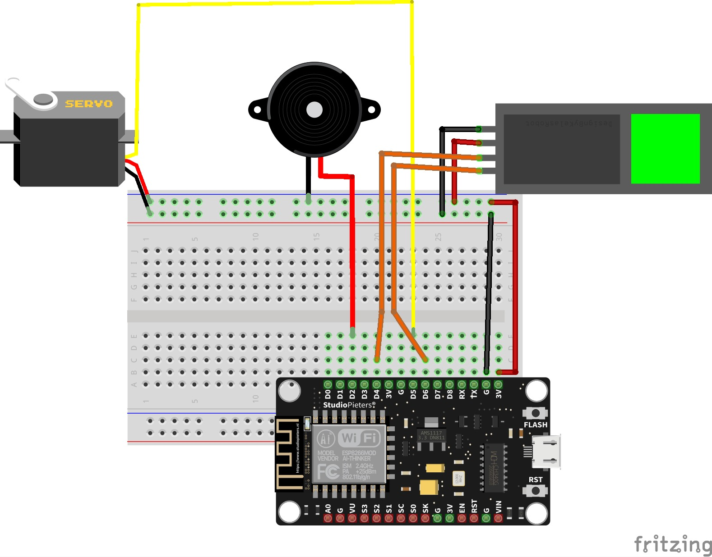

# PA - PRAKTIUM IOT - UNMUL

Kelompok 6 B 2021 :
- 2109106056 Ahmad Dhiya Ulhaqi
- 2109106078 Rian Syaputra Ainun Naim
- 2109106105 Rhesa Binsar Jeremiah Simbolon
- 2109106142 Galuh Endah Pambudi

## Smart Door
Perangkat ini dirancang untuk dapat memantau kondisi rumah dengan pintu rumah yang dilengkapi sensor gerak dan sensor sidik jari. Pengguna dapat mengatur kondisi sensor gerak dan mendapatkan notifikasi jika sensor gerak terpicu. Tedrdiri dari 2 rangkaian perangkat dan 1 platform :
- Perangkat 1 merupakan rangkaian dengan PIR sensor untuk mendeteksi gerakan;
- Perangkat 2 merupakan rangkaian dengan sensor sidik jari.
- Platform mobile yang dibangun menggunakan kodular.

**Pembagian Tugas :**
- 2109106056 Ahmad Dhiya Ulhaqi               : Perangkat 1
- 2109106078 Rian Syaputra Ainun Naim         : Perangkat 2
- 2109106105 Rhesa Binsar Jeremiah Simbolon   : Design interface platform
- 2109106142 Galuh Endah Pambudi              : Manual Book

**Komponen :**
- BreadBoard
- Kabel male to male dan male to female
- NodeMCU esp8266
- PIR sensor
- Servo
- Finger Print sensor
- Button
- Buzzer
- Kabel Micro USB

**Skema Perangkat :**

